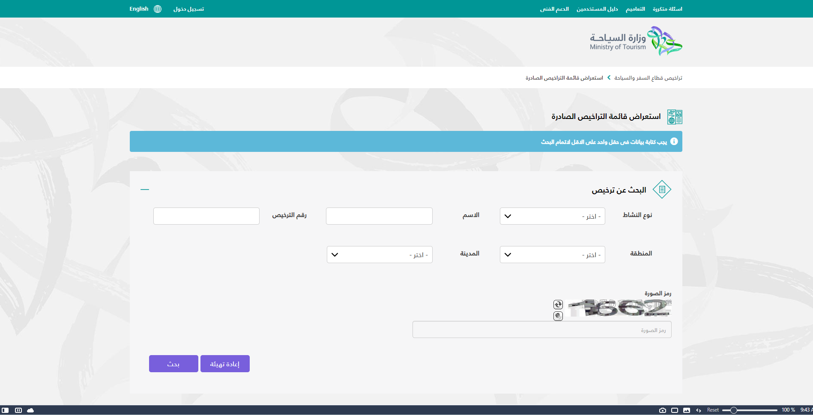

# Tourism Properties Scraper - KSA Government

## TOC:

- [Dependencies](#dependencies)
- [Scraper overview and how to run it](##scraper-overview-and-how-to-run-it)
- [Future Improvements](##future-improvements)

## Dependencies:

---

Since, I want to know the version of ChromeDriver for undetected Chrome, I use Pywin32 to figure that out. That's why it is really dependent on Windows (see the section below, future imporvements.)

And for sure, we need UndetectedChromeDriver which is based on Selenium as well as SpeechRecognition for bypassing Audio ReCaptcha and last but not least, requests and bs4 for the properties scraping.

To run this on your Pc. You will need to:

- Download a python version (>= 3.9) on your pc.
- Create a virtual env in your preferred place using: `python -m venv venv`
- Then you can activate the virtual enviornment
- After that, you can just run `python main.py`
- To include this in your end, the main selenium module is "tourist_companies_scraper" and the Properoties BS4 Scraper is links_parser.py
- You need to download ffprobe.exe, ffplay.exe, ffmpeg.exe in the code folder or in the path.

## Scraper overview and how to run it

---

This scraper used the government website of KSA to generate the listings. It uses Python Selenium Undetected Chromedriver for early navigation through pages to get the property links as well as SpeechRecognition to bypass Audio ReCaptcha.

The whole process is that it opens the ministry of Tourism in KSA, choose a specific dropbox (which can be chnaged), and then gets all the contact information for ~5000 listings.

The first part is used in selenium, but the contact information and listing scraping is made in Requests.py with multithreading to increase the speed.

## Future Improvements

---

## **Versatile OS Support:**

---

Since this, for now, only work on Windows, we can extend this by making it work on Linux and Mac. What needed to be addressed here is the function that searched for the installed Chrome Version on the OS as well as managing ffmpeg, ffprob, ffplay on Mac and Linux.

Most probably this won't actually be in my work plan, however, I will add it to my list, or if someone wants to give a hand, that would be actually good.

## **Changing Selenium to Ajax-based scraping (API):**

---

During my investigation there is already an available API for their website but they need a special way to work where you need to first bypass the Captcha then call their API? Or something like that. Sincce this project was time-sensitive and delays were acceptable, I decided to let it go and then go with selenium. However, for a more stable and a better experience (also really **FASTER**), we need to change this to Ajax. If you want real-time experience or to turn this into API-callable software, you will probably need to do that.

To start, go to your network tab and figure out the sequence of calling, as I don't believe I have enough time for this now.

However, I will add this to my list of imporvements as well.

## Bypassing Image ReCaptcha instead of Voice:

---

It will be far more stable and faster to bypass Image Recaptcha as the voice one isn't stable and requires a lot of refreshing to get it right.

I don't have experience with image recognition, so I might do it later when I learn it in depth.

## Cealner Code:

---

For a quick script, I didn't really care about cleaning the code much more. However, a lot of code can be cleaned better. Please, if you can lend a hand, that would be appreciated.

## Change Threading Parameters:

---

For my iinternet speed and my computer capabilities, I have made a fixed threadPool of 40, however, you can make this dynamic using some formulas like `cpu_count()*2` or others.
